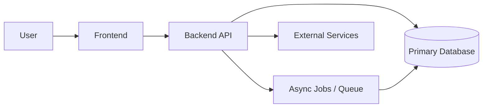

# Architecture Template

> Reference document for the target system architecture of a new project built from this scaffold.

## 1. Purpose

Use this document to define the high-level structure of the system before implementation scales.

Capture:

- system goals,
- major components,
- responsibility boundaries,
- cross-cutting concerns,
- and the architectural rules that AI agents and humans must follow.

## 2. Project Summary

Fill in:

- Project name:
- Product/problem statement:
- Primary users:
- Core business capability:
- Non-functional priorities:

## 3. Recommended Documentation Flow

Define architecture here first, then align:

- [02-database.md](02-database.md)
- [03-api-design.md](03-api-design.md)
- [12-backend.md](12-backend.md)
- [04-frontend.md](04-frontend.md)
- [06-infrastructure.md](06-infrastructure.md)
- [08-observability.md](08-observability.md)
- [09-testing.md](09-testing.md)

## 4. Architecture Overview

Describe the target architecture style:

- Monolith, modular monolith, microservices, event-driven, serverless, or hybrid
- Deployment model
- Main runtime platforms
- Internal and external system boundaries
- Whether the project will adopt Clean Architecture as the default internal structure

Example template:



## 5. Major Components

| Component | Responsibility | Technology | Notes |
| --- | --- | --- | --- |
| Frontend | User-facing application | TBD | |
| Backend API | Core business operations | TBD | |
| Worker / Jobs | Async processing | TBD | |
| Database | Source of truth | TBD | |
| Cache | Performance and ephemeral state | Optional | |
| Object Storage | Files and artifacts | Optional | |
| Observability Stack | Logs, metrics, traces | TBD | |

## 6. Cross-Cutting Concerns

Document the expected strategy for:

- Authentication and authorization
- Configuration and secrets
- Logging and tracing
- Error handling
- Multi-environment behavior
- Background processing
- Data protection and compliance
- Performance and scalability

## 7. Default Scaffold Enforcements

Unless the project explicitly documents a different approach, this scaffold starts with the following defaults:

- Prefer Clean Architecture or a similarly strict boundary-based modular design.
- Keep domain and core business rules independent from transport, UI, infrastructure, and persistence concerns.
- Make architectural dependency direction explicit and enforce it in project structure and reviews.
- Treat testing as part of implementation, not as a later hardening phase.
- Expect unit, integration, and end-to-end coverage from the start, with scope proportional to the feature.

### Clean Architecture Baseline

Use these rules as the default baseline for new projects:

- `Domain` or core business modules should not depend on infrastructure or UI concerns.
- `Application` or use-case modules may depend on domain/core modules only.
- `Infrastructure` should implement ports, adapters, persistence, messaging, and third-party integrations.
- `API` or delivery layers should orchestrate requests, authentication, response mapping, and composition.
- Cross-cutting concerns should be wired at the edge, not embedded in core business logic.

### Testing Baseline

The minimum expectation for a new project is:

- Unit tests for domain rules, core utilities, and isolated application logic
- Integration tests for database access, infrastructure adapters, and service/API boundaries
- End-to-end tests for the most important user-facing happy paths and critical regressions
- Bug fixes should include a regression test at the most appropriate level
- New features should prefer test-first or test-in-parallel development, especially where rules and workflows are non-trivial

## 8. Architectural Decision Log

Record explicit decisions as they become known.

| Decision Area | Selected Option | Status | Rationale |
| --- | --- | --- | --- |
| Backend framework | TBD | Open | |
| Frontend framework | TBD | Open | |
| Database engine | TBD | Open | |
| Hosting platform | TBD | Open | |
| Queue / jobs | TBD | Open | |
| Auth approach | TBD | Open | |

## 9. Repository Structure

Adjust this to the real project when code appears.

```text
project/
├── backend/
├── frontend/
├── infra/
├── docs/
├── specs/
├── scripts/
└── .github/
```

## 10. Rules for Contributors and Agents

- Respect documented layer boundaries.
- Do not introduce new infrastructure or frameworks without recording the decision.
- Prefer modular organization that remains understandable by AI agents working incrementally.
- Keep examples and naming consistent with the actual project once established.
- Default to testable seams and low coupling so unit and integration testing remain straightforward.

## 11. Open Questions

- What is the initial delivery shape: single deployable or multiple services?
- Which constraints matter most: speed, cost, compliance, scale, offline support?
- Which parts of the stack must be standardized across projects versus chosen case by case?
