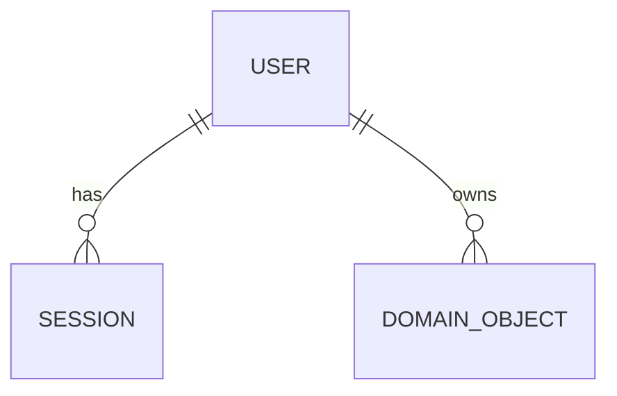

# Database Template

> Use this document to define the persistence model for the project once the domain starts taking shape.

## 1. Goals

Capture:

- primary data stores,
- persistence rules,
- naming and typing conventions,
- migration strategy,
- and data lifecycle expectations.

## 2. Data Store Inventory

| Store | Purpose | Technology | Status |
| --- | --- | --- | --- |
| Primary relational database | Core transactional data | TBD | Open |
| Cache | Performance / ephemeral state | Optional | Open |
| Search index | Full text / discovery | Optional | Open |
| Object storage | Files / media / exports | Optional | Open |

## 3. Domain Model Summary

List the main aggregates or entities after discovery:

| Domain Area | Core Entities | Notes |
| --- | --- | --- |
| Identity / Access | TBD | |
| Core business | TBD | |
| Billing / plans | Optional | |
| Audit / events | Optional | |

## 4. Schema Design Conventions

Fill in the standards the project adopts:

- ID type:
- Timestamps:
- Soft delete strategy:
- Audit columns:
- Naming convention:
- Nullability rules:
- Enum strategy:
- JSON/document columns:
- Currency / precision rules:

## 5. Sample ER Diagram Placeholder

Replace with a project-specific diagram when entities are known.

## 6. Multi-Tenancy or Data Partitioning

Choose one of:

- not applicable,
- logical isolation,
- physical isolation,
- hybrid isolation.

Document:

- tenant key or partition key,
- query filtering expectations,
- migration implications,
- reporting considerations.

## 7. Data Lifecycle

Define expectations for:

- creation,
- mutation,
- archival,
- retention,
- deletion,
- recovery,
- and legal/compliance constraints.

## 8. Migrations and Seed Data

- Migration tool:
- Ownership:
- Review expectations:
- Rollback strategy:
- Seed/reference data approach:

## 9. Performance Guidance

Document default practices such as:

- read/write splitting if applicable,
- indexing strategy,
- pagination rules,
- query profiling,
- and limits for expensive operations.

## 10. Open Decisions

| Area | Question | Owner | Status |
| --- | --- | --- | --- |
| Database engine | Which engine fits the workload? | TBD | Open |
| Search | Is dedicated search needed? | TBD | Open |
| Retention | What data must be archived or deleted? | TBD | Open |
