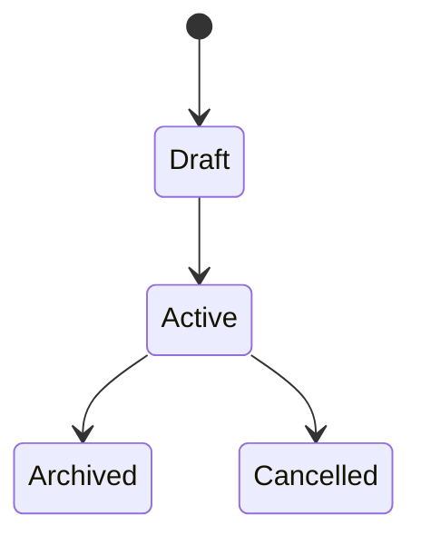

# Business Rules Template

> Use this document to capture domain behavior, invariants, and workflow rules once the project problem space is defined.

## 1. Scope

This file should become the source of truth for:

- domain terminology,
- lifecycle rules,
- status transitions,
- permission rules,
- and non-obvious business constraints.

## 2. Domain Language

Document the canonical terms used in the project.

| Term | Definition | Notes |
| --- | --- | --- |
| User | TBD | |
| Account / Workspace / Organization | TBD | |
| Core record | TBD | |

## 3. Core Actors

| Actor | Description | Capabilities |
| --- | --- | --- |
| End user | TBD | |
| Admin / operator | TBD | |
| External system | Optional | |

## 4. Main Workflows

List the workflows that matter most:

- onboarding,
- core transaction or primary action,
- approvals,
- notifications,
- reporting,
- exception handling.

## 5. Entity Rules Template

Repeat this section for each major domain concept.

### Example Entity

- Purpose:
- Required fields:
- Optional fields:
- Creation rules:
- Update rules:
- Deletion or archival rules:
- Ownership rules:
- Permission rules:
- Validation rules:

## 6. State Machines

Use diagrams where lifecycle matters.

## 7. Permissions Matrix

| Role | Resource | Allowed Actions | Notes |
| --- | --- | --- | --- |
| TBD | TBD | TBD | |

## 8. Invariants

Document rules that must always hold true.

- Example: A record cannot be activated without required dependencies.
- Example: A user can only mutate resources inside their authorized scope.

## 9. Operational Exceptions

Capture edge cases, manual override flows, and admin-only behavior.

## 10. Open Questions

- Which rules are compliance-driven versus product-driven?
- Which workflows need audit trails?
- Which actions are reversible versus permanent?
