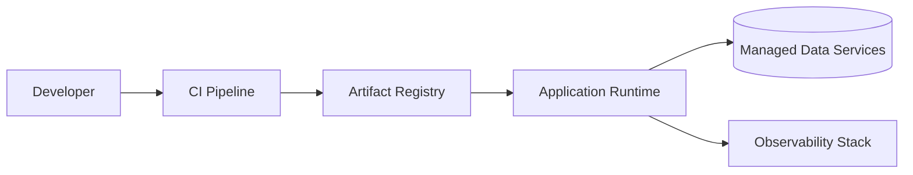

# Infrastructure Template

> Use this document to define environments, hosting, provisioning, and runtime topology.

## 1. Goals

Capture how the project will run in development, staging, production, and any special environments.

## 2. Environment Inventory

| Environment | Purpose | Owner | Notes |
| --- | --- | --- | --- |
| Local | Developer workflow | Engineering | |
| CI | Validation and packaging | Engineering | |
| Staging | Pre-production verification | Engineering / QA | |
| Production | Live traffic | Engineering / Ops | |

## 3. Platform Decisions

| Area | Selected Option | Status | Notes |
| --- | --- | --- | --- |
| Cloud / hosting | TBD | Open | |
| IaC tool | TBD | Open | |
| Container strategy | TBD | Open | |
| Secrets management | TBD | Open | |
| Database hosting | TBD | Open | |
| Object storage | TBD | Open | |

## 4. Runtime Topology

## 5. Local Development

Document:

- required tools,
- container or local-runtime strategy,
- seed data expectations,
- environment variables,
- common startup commands.

## 6. Provisioning Rules

- What must be provisioned through IaC
- What is allowed to be manual
- How environments stay in sync
- How secrets are injected

## 7. Security and Access

Define:

- least-privilege expectations,
- admin access flow,
- secret rotation approach,
- network boundaries,
- backup and disaster recovery ownership.

## 8. Open Questions

- Is multi-region or high availability required from day one?
- What infrastructure choices should stay standardized across future projects?
